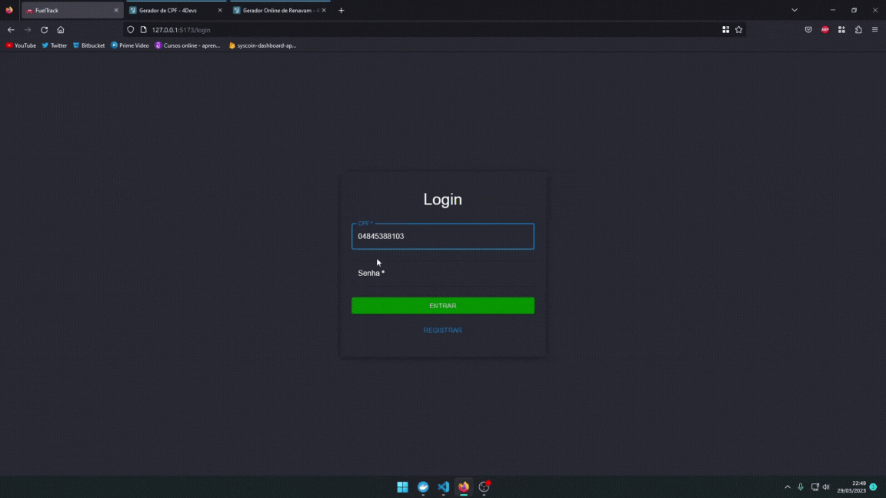

# FuelTrack

 

  

 

  

 

## Descrição

FuelTrack é uma aplicação web para o gerenciamento de veículos e abastecimentos. Com ela é possível cadastrar veículos, adicionar e visualizar abastecimentos e monitorar o desempenho dos veículos em termos de consumo de combustível.

## Funcionalidades

- Cadastro de veículos
- Cadastro de abastecimentos para os veículos
- Listagem de veículos
- Detalhes de um veículo (incluindo histórico de abastecimentos)
- Edição e exclusão de veículos e abastecimentos

## Tecnologias

- React
- Material-UI
- Node.js

## Como executar

1. Clone o repositório
2. Na pasta raiz do projeto, execute o comando `npm install` para instalar as dependências do servidor
3. Para rodar o backend vá para o meu outro repositório: https://github.com/sTrkalec/Fueltrack
4.Após rodar o backend conforme a documentação ensina, na pasta raiz do projeto do front, execute o comando `npm run dev` para iniciar o servidor e o cliente em modo de desenvolvimento
5. Abra o navegador e acesse a URL `http://localhost:5173`

## Licença

Este projeto está licenciado sob a Licença MIT.
